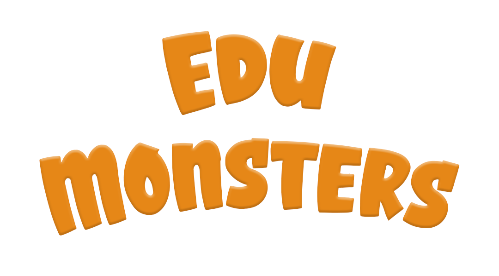

# Educational Game Platform - HTML5 Quiz Adventure




Welcome to EduMonsters, an interactive HTML5 educational game where you'll embark on a quiz adventure, battling monsters of different strengths with your knowledge. This platform also includes a robust backend administration panel for creating new quizzes and organizing questions.

## Table of Contents
- [Introduction](#introduction)
- [Features](#features)
- [Getting Started](#getting-started)
- [Backend Setup](#backend-setup)
- [Building Tools](#building-tools)
- [Contributing](#contributing)
- [License](#license)

## Introduction

The Educational Game Platform is designed to provide an engaging and educational experience. Test your knowledge, defeat monsters, and explore a world of learning. The included backend administration panel makes it easy for educators to customize quizzes and questions.

To try a demo challenge, go to: https://edumonsters.net/  Click 'Student', Enter code: "qnux", then click 'Enter'   

## Features

- **Quiz Adventure**: Engage in an exciting quiz-based adventure.
- **Monsters**: Battle monsters of varying strengths based on your answers.
- **Knowledge Enhancement**: Learn new facts and information with each question.
- **Backend Administration Panel**: Create and manage quizzes with ease.

## Getting Started

To run the Educational Game Platform, you'll need a local PHP server (WAMP, MAMP, LAMP) and Python for some building tools. Follow these steps:

1. Start your local PHP server and ensure it's running.
- [WAMP](https://www.wampserver.com/en/) Windows
- [MAMP](https://www.mamp.info/) MacOS
- [LAMP](https://ubuntu.com/server/docs/lamp-applications) Linux

2. Access the platform by visiting `http://localhost/edumonsters/index.html` in your web browser.

## Backend Setup

The backend of the platform is written in PHP and requires a PHP web server. To set up the backend:

1. Ensure you have PHP installed on your server.

2. Configure the backend settings in the `admin/config.php` file to match your server environment.

3. Import the provided SQL schema file `admin/schema.sql` into your database management system to set up the database schema.

4. Start your PHP server.

5. Access the administration panel by visiting `http://localhost/edumonsters/admin` in your browser.

6. The login credentials are:
- username: admin
- password: admin

## Building Tools

Some building tools in this project require Python to run. Make sure you have Python installed on your system to utilize these tools.

- To create a build from the game you need to run the release.py script 
``` py tools/release/release.py ```
- To help the development of the UI of the game also a visual editor is included  , you can access the editor by visiting `http://localhost/edumonsters/editor`

## Contributing

We welcome contributions from the open-source community! If you'd like to contribute to the project, please follow our [Contribution Guidelines](CONTRIBUTING.md).

## License

This project is licensed under the MIT License. See the [LICENSE](LICENSE) file for details.

## Files Disclaimer

Credit for the image files used in this project goes to: https://itch.io/profile/acrossstampsandtime  under creative commons license: https://creativecommons.org/licenses/by/4.0/

This project utilizes specific audio files that have been purchased for its functionality. These audio files are not included in the open-source code and must be sourced independently by anyone planning to use this codebase.

Please note that it is the responsibility of users to ensure they have the necessary rights and licenses for any audio files they choose to integrate into the project. Ensure compliance with all relevant copyright and licensing agreements before using or distributing any audio content in association with this project.
